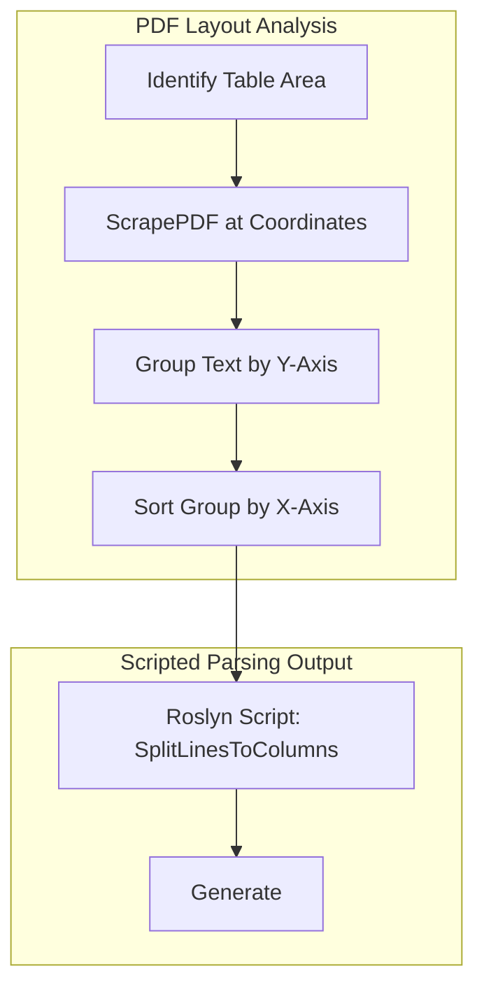

# SpatialPdfParser

<span style="font-size: 20px;">

#### SpatialPdfParser   is a .NET library for structured data extraction from PDFs. It combines XML-based spatial mapping with **Roslyn C#** scripting to transform raw document coordinates into clean, validated data.
---

## 💡 Key Features
**Spatial Extraction:**  Target specific regions of a PDF using X, Y coordinates and bounding boxes.

**Dynamic Scripting:** Use <% ... %> tags to execute real-time C# logic (splitting strings, regex, formatting) via Microsoft.CodeAnalysis.CSharp.Scripting.

**Hierarchical Mapping:** Define complex nested objects (e.g., Orders > Parties > Addresses) in a clean XML format.

**Table Support:** Specialized logic to segregate blocks of text into tabular data structures based on vertical proximity.

---
<div style="margin-top: 30px;">

### 🎯 Extraction Case Study: PO4.pdf**
</div>

Based on the this xml ,the **po4.pdf** (see image below) is scanned in spatial terms and  the library  maps raw text fragments to XML elements or attributes:

Header Data: Captures "PO Date" (2025-09-04) and "PO Number" (10346).

Party Identification: Segregates "Buyer" and "Supplier"  details.

Complex Table Mapping: Iterates through the item table to create <line/> elements for items like Workstations.


 ```xml
<?xml version="1.0" encoding="utf-8"?>
<pdfMap client="IrisSystems" document="PurchaseOrder" rootName="po"    pdfSource="c:\\temp\\PO4.pdf">
  <po  number="&lt;%ScrapePDF(x:505,scanBelowY:793,width:50,line2LineGap:10) %&gt;" date="&lt;%ScrapePDF(x:168,scanBelowY:753,width:50,line2LineGap:10) %&gt;">
    <parties>
      <buyer  name="&lt;%ScrapePDF(x:46,scanBelowY:652,width:50,line2LineGap:10) %&gt;">
        <delivery date="&lt;%  ScrapePDF(x:427,scanBelowY:753,width:100,line2LineGap:10) %&gt;" />
        <address map="&lt;%  Split(ScrapePDF(x:46,scanBelowY:634,width:50,line2LineGap:10), new string[] {&quot;street&quot;, &quot;city&quot;, &quot;postcode&quot;, &quot;country&quot;}	) %&gt;"/>
        <contact map="&lt;% Split(ScrapePDF(x:46,scanBelowY:615,width:50,line2LineGap:10),new string[]{&quot;telephone&quot;,&quot;email&quot;},delimiter:'|') %&gt;"/>
      </buyer>
      <seller  name="&lt;%ScrapePDF(x:299,scanBelowY:653,width:50,line2LineGap:10) %&gt;">
          <address map="&lt;%  Split(ScrapePDF(x:298,scanBelowY:634,width:50,line2LineGap:10), new string[] {&quot;street&quot;, &quot;city&quot;, &quot;postcode&quot;, &quot;country&quot;}	) %&gt;"/>
        <contact map="&lt;% Split(ScrapePDF(x:298,scanBelowY:615,width:50,line2LineGap:10),new string[]{&quot;telephone&quot;,&quot;email&quot;},delimiter:'|') %&gt;"/>
        </seller>
    </parties>
    <po1loop map="&lt;%  SplitLinesToColumns(ScrapePDF(x:39,scanBelowY:502,width:515,line2LineGap:30),new string[]{ &quot;description&quot;,&quot;partnumber&quot;,&quot;qty&quot;,&quot;unitPrice&quot;,&quot;lineTotal&quot;}) %&gt;" />
  </po>
</pdfMap>
 ```
 ### Input PDF Content
The source document contains structured tables for dates and items, along with blocks for buyer and supplier info.
 

### Generated XML Output
SpatialPdfParser transforms the raw text into the following structured format:
 ```xml
 <pdfMap client="IrisSystems" document="PurchaseOrder" rootName="po" pdfSource="c:\\temp\\PO4.pdf">
  <po number="10346" date="2025-09-04">
    <parties>
      <buyer name="NextGen Tech Corp">
        <delivery date="2025-09-20"></delivery>
        <address street="77 Bay Street" city="Toronto" postcode="ON M5J 2L9" country="Canada"></address>
        <contact telephone="+1 (416) 555-7789" email="finance@nextgen.com"></contact>
      </buyer>
      <seller name="Metro Office Furniture Co.">
        <address street="1750 Market St" city="Denver" postcode="CO 80202" country="USA"></address>
        <contact telephone="+1 (303) 555-9922" email="sales@metrooffice.com"></contact>
      </seller>
    </parties>
    <po1loop>
      <line description="Workstations (Cubicle)" partnumber="MOF-WS600" qty="8" unitPrice="$ 850.00" lineTotal="6,800.00"></line>
      <line description="Storage Cabinets" partnumber="MOF-SC100" qty="6" unitPrice="$ 295.00" lineTotal="1,770.00"></line>
      <line description="Task Chairs" partnumber="MOF-TC210" qty="15" unitPrice="$ 175.00" lineTotal="2,625.00"></line>
      <line description="Breakroom Tables" partnumber="MOF-BT50" qty="4" unitPrice="$ 310.00" lineTotal="1,240.00"></line>
      <line description="Rambutan" partnumber="RAM-BUT1" qty="20" unitPrice="$ 40.00" lineTotal="800.00"></line>
    </po1loop>
  </po>
</pdfMap>
```


### 🔄 Execution Logic

The following diagram shows how SpatialPdfParser handles the po1loop in the  XML :
Code snippet



### 📐 Coordinate Reference

**SpatialPdfParser** uses the standard PDF coordinate system where the origin (0,0) is at the **Bottom-Left**.

| Source Fragment | PDF Y-Coordinate | Screen Y-Equivalent |
| --- | --- | --- |
| Purchase Order (Header) | High (~800) | Low (~50) |
| Total USD (Footer) | Low (~100) | High (~750) |

> **Note:** If you are using coordinates from a design tool (like Figma or Chrome DevTools), you will likely need to invert your Y-axis values to match the PDF coordinate system.


