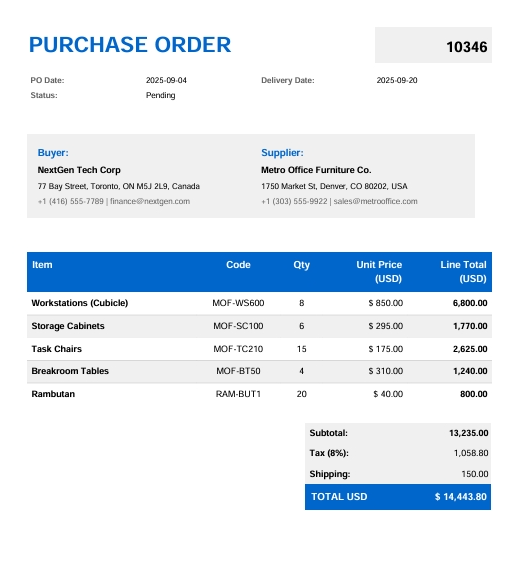

# PDFToXml

**PDFToXml** is an open-source, layout-driven document extraction engine that converts **PDF documents** into **XML, HTML, or X12** by defining the PDF structure in a simple, declarative XML mapping file.

Instead of writing custom parsers for every document type, PDFToXml lets you describe *where data appears on the page*. The engine handles parsing, transformation, and structured output generation.

---

## ✨ Features

- 📄 Convert **PDF → XML, HTML, or X12**
- 🧩 Declarative, human-readable **XML layout definitions**
- 📐 Coordinate-based extraction for high accuracy
- 🛠 Extensible helper-function architecture
- 🔁 Reusable mappings for similar document templates
- 🏢 Designed for enterprise documents (POs, invoices, EDI)

---

## 🧠 How It Works

1. **Provide a PDF input document**
2. **Define an XML layout mapping** describing where data lives on the PDF
3. **Run the parser**
4. **Generate structured output** (XML / HTML / X12)

No document-specific code required.

---

## 📘 Example: Purchase Order Extraction

This example demonstrates the complete flow from **PDF input** → **XML layout definition** → **generated XML output**.

---

### 📄 PDF Input Document

The input PDF is a Purchase Order containing fixed-position fields and a tabular line-item section.

**Purchase Order (PO4.pdf)** includes:

- Purchase Order number and dates
- Buyer and supplier details
- Addresses and contact information
- Line-item table with quantities and pricing

#### PDF in Repository (GitHub-friendly)



### 🧩 XML Layout Definition (PDF Scan Map)

Below is the **complete XML layout definition** used to scan and extract data from the PDF.

Despite mapping a full purchase order—including header fields, parties, addresses, contacts, and line items—the definition remains **compact, readable, and declarative**.  
Each field is extracted by describing *where it appears on the page*, not *how to parse it*.

```xml
<?xml version="1.0" encoding="utf-8"?>
<pdfMap client="IrisSystems" document="PurchaseOrder" rootName="po" pdfSource="c:\\temp\\PO4.pdf">
  <po
    number="<% ScrapePDF(x:505, scanBelowY:793, width:50, line2LineGap:10) %>"
    date="<% ScrapePDF(x:168, scanBelowY:753, width:50, line2LineGap:10) %>">

    <parties>
      <buyer name="<% ScrapePDF(x:46, scanBelowY:652, width:50, line2LineGap:10) %>">
        <delivery date="<% ScrapePDF(x:427, scanBelowY:753, width:100, line2LineGap:10) %>" />

        <address map="<% Split(
          ScrapePDF(x:46, scanBelowY:634, width:50, line2LineGap:10),
          new string[] { 'street', 'city', 'postcode', 'country' }
        ) %>" />

        <contact map="<% Split(
          ScrapePDF(x:46, scanBelowY:615, width:50, line2LineGap:10),
          new string[] { 'telephone', 'email' },
          delimiter:'|'
        ) %>" />
      </buyer>

      <seller name="<% ScrapePDF(x:299, scanBelowY:653, width:50, line2LineGap:10) %>">
        <address map="<% Split(
          ScrapePDF(x:298, scanBelowY:634, width:50, line2LineGap:10),
          new string[] { 'street', 'city', 'postcode', 'country' }
        ) %>" />

        <contact map="<% Split(
          ScrapePDF(x:298, scanBelowY:615, width:50, line2LineGap:10),
          new string[] { 'telephone', 'email' },
          delimiter:'|'
        ) %>" />
      </seller>
    </parties>

    <po1loop map="<% SplitLinesToColumns(
      ScrapePDF(x:39, scanBelowY:502, width:515, line2LineGap:30),
      new string[] { 'description', 'partnumber', 'qty', 'unitPrice', 'lineTotal' }
    ) %>" />

  </po>
</pdfMap>


# Purchase Order Processing

This section describes the data extraction and mapping process for the input documentation.

## Input Document
You can view the source file here: 
[📄 View Input PDF (PO4.pdf)](po4.pdf)

---

## Output Data Structure
The following XML represents the structured data extracted from the document. It maps the purchase order details, including buyer/seller information and line items.

```xml
<pdfMap client="IrisSystems" document="PurchaseOrder" rootName="po" pdfSource="c:\temp\PO4.pdf">
  <po number="10346" date="2025-09-04">
    <parties>
      <buyer name="NextGen Tech Corp">
        <delivery date="2025-09-20"></delivery>
        <address street="77 Bay Street" city="Toronto" postcode="ON M5J 2L9" country="Canada"></address>
        <contact telephone="+1 (416) 555-7789" email="finance@nextgen.com"></contact>
      </buyer>
      <seller name="Metro Office Furniture Co.">
        <address street="1750 Market St" city="Denver" postcode="CO 80202" country="USA"></address>
        <contact telephone="+1 (303) 555-9922" email="sales@metrooffice.com"></contact>
      </seller>
    </parties>
    <po1loop>
      <line description="Workstations (Cubicle)" partnumber="MOF-WS600" qty="8" unitPrice="$ 850.00" lineTotal="6,800.00"></line>
      <line description="Storage Cabinets" partnumber="MOF-SC100" qty="6" unitPrice="$ 295.00" lineTotal="1,770.00"></line>
      <line description="Task Chairs" partnumber="MOF-TC210" qty="15" unitPrice="$ 175.00" lineTotal="2,625.00"></line>
      <line description="Breakroom Tables" partnumber="MOF-BT50" qty="4" unitPrice="$ 310.00" lineTotal="1,240.00"></line>
      <line description="Rambutan" partnumber="RAM-BUT1" qty="20" unitPrice="$ 40.00" lineTotal="800.00"></line>
    </po1loop>
  </po>
</pdfMap>

###


graph TD
    %% Node Definitions
    PDF[Source: PO4.pdf]
    Map{pdfMap}
    Header[PO Header: #10346]

    subgraph S1 [Stakeholders]
    Buyer[Buyer: NextGen Tech]
    Seller[Seller: Metro Office]
    end

    subgraph S2 [Line Items]
    L1[Line 1: Workstations]
    L2[Line 2: Cabinets]
    L3[Line 3: Chairs]
    L4[Line 4: Tables]
    L5[Line 5: Rambutan]
    end

    %% Flow
    PDF --> Map
    Map --> Header
    Map --> S1
    Map --> S2

    %% Styling
    classDef source fill:#d4e5ff,stroke:#0052cc,stroke-width:2px;
    classDef party fill:#d5f5e3,stroke:#1d8348,stroke-width:2px;
    classDef items fill:#fef5e7,stroke:#af601a,stroke-width:2px;

    class PDF source;
    class Buyer,Seller party;
    class L1,L2,L3,L4,L5 items;


    

```mermaid  

graph TD
    %% Node Definitions
    PDF[Source: PO4.pdf]
    Map{pdfMap}
    Header[PO Header: #10346]
    
    subgraph S1 [Stakeholders]
    Buyer[Buyer: NextGen Tech]
    Seller[Seller: Metro Office]
    end

    subgraph S2 [Line Items]
    L1[Line 1: Workstations]
    L2[Line 2: Cabinets]
    L3[Line 3: Chairs]
    L4[Line 4: Tables]
    L5[Line 5: Rambutan]
    end

    %% Flow
    PDF --> Map
    Map --> Header
    Map --> S1
    Map --> S2

    %% Styling
    classDef source fill:#d4e5ff,stroke:#0052cc,stroke-width:2px;
    classDef party fill:#d5f5e3,stroke:#1d8348,stroke-width:2px;
    classDef items fill:#fef5e7,stroke:#af601a,stroke-width:2px;

    class PDF source;
    class Buyer,Seller party;
    class L1,L2,L3,L4,L5 items;


