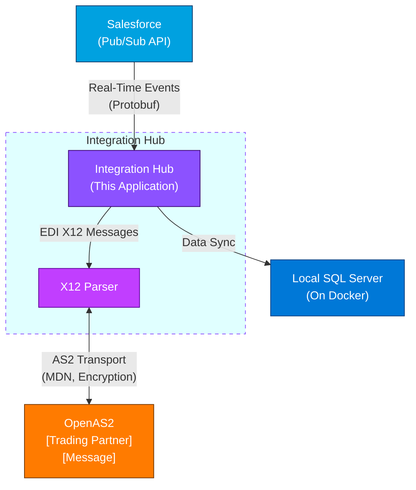
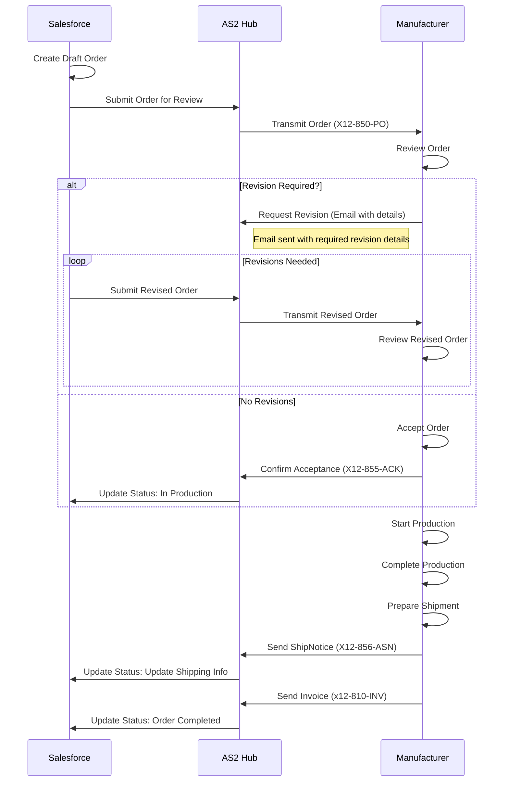


# 🚀 Salesforce ↔ OpenAS2 ↔ SQL Server Integration

## 📖 Overview
This application demonstrates seamless integration between **Salesforce**, **OpenAS2**, and **SQL Server**.

It leverages the **Salesforce Pub/Sub API** to listen for real-time change events—**Create**, **Update**, and **Delete**—on selected Salesforce objects.  
The system also simulates the submission of **Salesforce E-Bikes** orders to the manufacturer via the Pub/Sub API, transmitted over the **OpenAS2 protocol**.

When a change event is received, it is **deserialized using Google Protobuf**, processed, and synchronized into a **SQL Server** database.  
This ensures that Salesforce data remains current, accurate, and accessible locally for downstream processes or reporting.

Additionally, the project implements **EDI X12 message exchanges** using the **AS2 protocol**.  
For example, when an order status transitions to `'Submitted to Manufacturing'`, the system automatically generates and transmits the corresponding **EDI documents** to the trading partner.

---

## 🧩 Architecture




---


### Salesforce Setup
- Enable **Change Data Capture (CDC)** or relevant **Platform Events** for the target objects.  
- Ensure a Salesforce user with API access and sufficient permissions to subscribe to these events.

### SQL Server
- A reachable SQL Server instance.  
- A database with tables corresponding to the Salesforce objects you want to sync. The application can dynamically create or update tables if configured.

### Environment Configuration
- **SQL Server connection string** (configured in `appsettings.json`).  
- **Salesforce credentials** and OAuth configuration (in `appsettings.json`).  
- **Optional:** Folder for storing **Protobuf schema files** used for event deserialization.

---

## Features
- **Real-time subscription** to Salesforce change events via the Pub/Sub API.  
- **Automatic deserialization** of event payloads using Google Protobuf.  
- **Flexible processing pipeline** to insert or update records in SQL Server.  
- **EDI X12 support** over AS2 protocol for order submission and status updates.  
- **Logging and status reporting** to monitor synchronization and EDI processing.

## Order Status 
The **Order Status** tracks the progress of an order as it moves between Salesforce (sales side) and the Manufacturer (production side).
- **Draft** *(Salesforce)*  
  Order is newly created in Salesforce.

- **Submitted to Manufacturing** *(Salesforce → Manufacturer)*  
  Order is formally sent to the manufacturer for review and scheduling.

- **Revision Required** *(Manufacturer → Salesforce)*  
  Manufacturer requests changes due to missing/incorrect details, pricing/options issues, or capacity limits.  
  A separate email from the manufacturer provides specific revision details.

- **In Production** *(Manufacturer)*  
  Order is accepted and is actively being manufactured.

- **Completed** *(Manufacturer → Salesforce)*  
  Manufacturing is finished, and the order is marked as ready for delivery in Salesforce.

  ---

# Order Status Flow

The **Order Status** tracks the progress of an order as it moves between **Salesforce (sales side)** and the **Manufacturer (production side)**.

# Order Status Flow

The **Order Status** tracks the progress of an order as it moves between **Salesforce (sales side)** and **Manufacturer (production side)**. A decision point after submission determines if revisions are required or if the order is accepted.
# Order Status Sequence Diagram

The **Order Status** tracks the interactions between **Salesforce (sales side)** and **Manufacturer (production side)** as an order progresses through its lifecycle, including a decision point for revisions.



---
## Partnership defintions for EDI Integration
The E-Bikes Sales(E-Bikes-S) and E-Bikes Manufacturing (E-Bikes-M) are seperate entities. They operate independently but collaborate closely on order processing and fulfillment. The E-Bikes Sales team focuses on customer interactions, order management, and sales strategies, while the E-Bikes Manufacturing team handles production, quality control, and logistics. Their partnership ensures a seamless experience for customers from order placement to delivery.<br>

**E-Bikes-S**: Manages customer orders, sales processes, and order submissions to the manufacturer.

**E-Bikes-M**: Responsible for producing the bikes, managing inventory, and fulfilling orders received from E-Bikes Sales.

Based on the partnership, the E-Bikes Sales team submits orders to the E-Bikes Manufacturing team for production and fulfillment. The manufacturing team reviews, processes, and ships the orders back to the sales team for delivery to customers.
as such, the E-Bikes-S needs to maintain agreed upon partnership details with E-Bikes-M for EDI transactions.
susch as AS2 identifiers, certificates, and endpoint URLs. ensure these details are correctly configured in the application settings to facilitate smooth EDI communication.
###
Creating Partnership profile in the **E-Bikes-S** system:
1. **AS2 Identifier**: Unique identifier for E-Bikes-S in AS2 communications (e.g., `EBIKES-S`). And the corresponding identifier for E-Bikes-M (e.g., `EBIKES-M`).

```mermaid
flowchart LR
    A[OpenAS2 Partnership Details] -->|REST API| B[Middleware / Integration Service]
    B -->|Salesforce REST API| C[Salesforce Custom Object: Trading_Partner__c]

    


