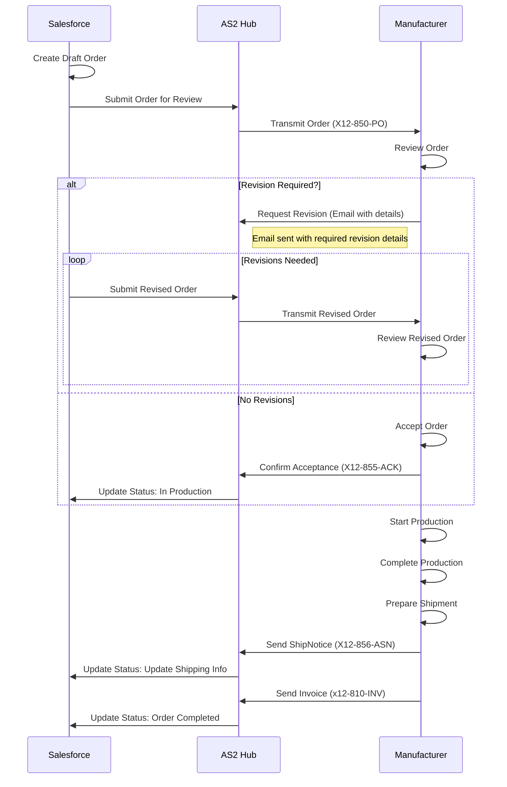
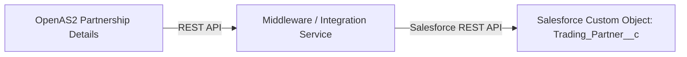
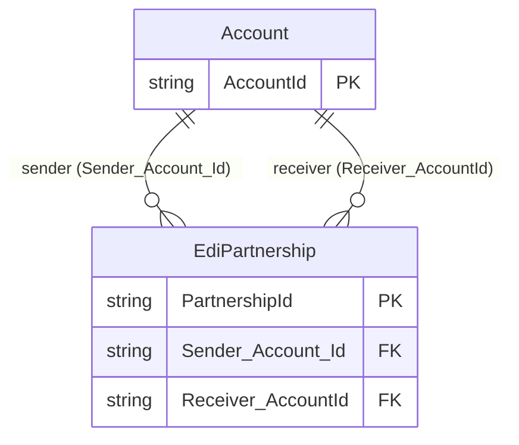

# Salesforce CDC EDI Hub

## Overview

This application integrates with Salesforce using the **Pub/Sub API** to listen for real-time change events (Create, Update, Delete) on selected Salesforce objects. It also simulates submission of Salesforce EBikes orders to the manufacturer via the Pub/Sub API over the **OpenAS2 protocol**.  

When an event is received, it is **deserialized using Google Protobuf**, processed, and synchronized into a **SQL Server database**, ensuring that Salesforce data remains up-to-date and accessible locally.  

Additionally, the project implements **EDI X12 interactions via the AS2 protocol**. For example, when an order status changes to `'Submitted to Manufacturing'`, the system automatically initiate and transmits the corresponding EDI documents.

---

## Prerequisites

### Adding new *Salesforce* Status to facilitate EDI integration

Add new picklist values (`Completed` and `Revision Required`) to the `Status__c` field in Salesforce.  
These values correspond to the order status flow shown in the sequence diagram, tracking the order lifecycle between Salesforce and the Manufacturer.

---
##Allowing Salesforce to access OpenAS2 REST endpoints

---

## Steps to Add Picklist Values

1. **Navigate to Object Manager in Setup**
   - In the **Quick Find** box, search for **Order__c** (or your custom object) and select it.

2. **Access the Status__c Field**
   - In **Order__c**, click **Fields & Relationships**.
   - Click the `Status__c` field name to edit.

3. **Add New Picklist Values**
   - In the **Picklist Values** section, click **New**.
   - Enter the values:
     - `Completed`
     - `Revision Required`
   - (Optional) Set a default value for new orders (e.g., `Draft`).
   - Click **Save**.

4. **Update Record Types (If Applicable)**
   - If your org uses record types, ensure the new values are assigned to the relevant record types.
   - Go to **Object Manager** > **Order__c** > **Record Types**.
   - Select a record type and edit the picklist values for `Status__c`.
   - Add `Completed` and `Revision Required` to the **Selected Values** list.
   - Save.

5. **Verify Field-Level Security**
   - Ensure the `Status__c` field is accessible to the relevant profiles:
     - Click **Set Field-Level Securi**


### Salesforce Setup
- Enable **Change Data Capture (CDC)** or relevant **Platform Events** for the target objects.  
- Ensure a Salesforce user with API access and sufficient permissions to subscribe to these events.

### SQL Server
- A reachable SQL Server instance.  
- A database with tables corresponding to the Salesforce objects you want to sync. The application can dynamically create or update tables if configured.

### Environment Configuration
- **SQL Server connection string** (configured in `appsettings.json`).  
- **Salesforce credentials** and OAuth configuration (in `appsettings.json`).  
- **Optional:** Folder for storing **Protobuf schema files** used for event deserialization.

---

## Features
- **Real-time subscription** to Salesforce change events via the Pub/Sub API.  
- **Automatic deserialization** of event payloads using Google Protobuf.  
- **Flexible processing pipeline** to insert or update records in SQL Server.  
- **EDI X12 support** over AS2 protocol for order submission and status updates.  
- **Logging and status reporting** to monitor synchronization and EDI processing.

## Order Status 
The **Order Status** tracks the progress of an order as it moves between Salesforce (sales side) and the Manufacturer (production side).
- **Draft** *(Salesforce)*  
  Order is newly created in Salesforce.

- **Submitted to Manufacturing** *(Salesforce → Manufacturer)*  
  Order is formally sent to the manufacturer for review and scheduling.

- **Revision Required** *(Manufacturer → Salesforce)*  
  Manufacturer requests changes due to missing/incorrect details, pricing/options issues, or capacity limits.  
  A separate email from the manufacturer provides specific revision details.

- **In Production** *(Manufacturer)*  
  Order is accepted and is actively being manufactured.

- **Completed** *(Manufacturer → Salesforce)*  
  Manufacturing is finished, and the order is marked as ready for delivery in Salesforce.

  ---

# Order Status Flow

The **Order Status** tracks the progress of an order as it moves between **Salesforce (sales side)** and the **Manufacturer (production side)**.

# Order Status Flow

The **Order Status** tracks the progress of an order as it moves between **Salesforce (sales side)** and **Manufacturer (production side)**. A decision point after submission determines if revisions are required or if the order is accepted.
# Order Status Sequence Diagram

The **Order Status** tracks the interactions between **Salesforce (sales side)** and **Manufacturer (production side)** as an order progresses through its lifecycle, including a decision point for revisions.



---
## Partnership defintions for EDI Integration
The E-Bikes Sales(E-Bikes-S) and E-Bikes Manufacturing (E-Bikes-M) are seperate entities. They operate independently but collaborate closely on order processing and fulfillment. The E-Bikes Sales team focuses on customer interactions, order management, and sales strategies, while the E-Bikes Manufacturing team handles production, quality control, and logistics. Their partnership ensures a seamless experience for customers from order placement to delivery.<br>

**E-Bikes-S**: Manages customer orders, sales processes, and order submissions to the manufacturer.

**E-Bikes-M**: Responsible for producing the bikes, managing inventory, and fulfilling orders received from E-Bikes Sales.

Based on the partnership, the E-Bikes Sales team submits orders to the E-Bikes Manufacturing team for production and fulfillment. The manufacturing team reviews, processes, and ships the orders back to the sales team for delivery to customers.
as such, the E-Bikes-S needs to maintain agreed upon partnership details with E-Bikes-M for EDI transactions.
susch as AS2 identifiers, certificates, and endpoint URLs. ensure these details are correctly configured in the application settings to facilitate smooth EDI communication.
###
Creating Partnership profile in the **E-Bikes-S** system:
1. **AS2 Identifier**: Unique identifier for E-Bikes-S in AS2 communications (e.g., `EBIKES-S`). And the corresponding identifier for E-Bikes-M (e.g., `EBIKES-M`).




---

# Setting Up Salesforce to Access OpenAS2 Server REST Endpoint on Localhost

To integrate Salesforce with an OpenAS2 server REST endpoint running on localhost, you need to configure Salesforce to communicate with the OpenAS2 server for EDI transactions, as outlined in the Salesforce CDC EDI Hub for the E-Bikes application [](https://github.com/apeiris/OpenAs2App.git) is running locally, additional steps are required to ensure secure and reliable communication. Below are the steps to configure Salesforce to interact with the OpenAS2 REST endpoint.

---

## Prerequisites

1. **OpenAS2 Server Setup**:
   - Ensure the OpenAS2 server is running locally (e.g., `http://localhost:8080` for the REST endpoint).
   - Verify the REST API is accessible locally and supports endpoints for partnership management, message transmission (e.g., X12-850 Purchase Orders), or status updates.
   - **Note**: A localhost endpoint cannot be directly accessed from Salesforce’s cloud environment. Use a tunneling solution (e.g., ngrok) or a publicly accessible server for production.

2. **Salesforce Setup**:
   - Ensure administrative access to Salesforce and permissions to configure integrations.
   - Enable **Change Data Capture (CDC)** or **Platform Events** for the `Order__c` object, as described in the provided document.
   - Verify the `Status__c` picklist on the `Order__c` object includes values: `Draft`, `Submitted to Manufacturing`, `Revision Required`, `In Production`, and `Completed`.

3. **Environment**:
   - A valid Salesforce OAuth configuration for API access (client ID, client secret, etc.).
   - A SQL Server instance for local data synchronization (configured in `appsettings.json` of the OpenAS2 server).
   - Optional: Protobuf schema files for deserializing Salesforce CDC events.

---

## Steps to Configure Salesforce for OpenAS2 REST Endpoint

### 1. Expose the Local OpenAS2 Server

Since Salesforce is cloud-based, it cannot directly access `http://localhost:8080`. Make the OpenAS2 REST endpoint publicly accessible using a tunneling service like **ngrok** for development:

- **Install and Run ngrok**:
  - Download and install ngrok [](https://ngrok.com/).
  - Run the following command to expose your local OpenAS2 server (assuming it’s on port 8080):
    ngrok http 8080

 --**Setup remote url in Salesforce to point to the ngrok url**
   - Note the generated public URL (e.g., `https://abcd1234.ngrok.io`).
   - add `/api/partnerships` or other relevant paths to the base URL for specific endpoints.    
   -


   ```mermaid
   sequenceDiagram

    participant S as Salesforce (E-Bikes-S)
    participant AS2 as OpenAS2 Server
    participant M as Manufacturer (E-Bikes-M)


    %% Retrieve Predefined Partner/Partnership Details
    
    Note over S,AS2: OpenAS2 UI used to create partners (EBIKES-S, EBIKES-M) with account details, addresses, contacts
    S->>AS2: GET /api/partnerships?partnerId=EBIKES-M
    AS2-->>S: 200 OK (Partner Details: AS2 ID, Endpoint URL, Certificate, Address, Contact)
    Note over S: Store partner details in Trading_Partner__c object
    %% Order Submission (EDI Payload Transmission)
    
    S->>S: Order Status Updated to "Submitted to Manufacturing"
    S->>AS2: POST /api/messages (X12-850 Purchase Order, AS2-From=EBIKES-S, AS2-To=EBIKES-M)
    AS2->>M: Transmit X12-850 Purchase Order to EBIKES-M Endpoint
    M-->>AS2: 200 OK (Order Received)

    %% Order Review and Response
    alt Revision Required
        M->>AS2: POST /api/messages (Email with Revision Details)
        AS2->>S: Update Order Status to "Revision Required"
        Note over S,M: Salesforce updates order, resubmits if needed
        loop Revisions
            S->>AS2: POST /api/messages (Revised X12-850 Payload)
            AS2->>M: Transmit Revised X12-850
            M-->>AS2: 200 OK (Revised Order Received)
        end
    else Order Accepted
        M->>AS2: POST /api/messages (X12-855 Acknowledgment)
        AS2->>S: Update Order Status to "In Production"
    end

    %% Production and Shipment
    M->>M: Start Production
    M->>M: Complete Production
    M->>AS2: POST /api/messages (X12-856 Advance Ship Notice)
    AS2->>S: Update Order Status with Shipping Info<http://localhost:8080/api/partnerships>

    %% Invoice and Completion
    M->>AS2: POST /api/messages (X12-810 Invoice)
    AS2->>S: Update Order Status to "Completed"
    Note over S,M: Order lifecycle completed

```
### 



## EdiPartnership__c metadata for the Salesforce
### PartnershipId__c
```xml
<?xml version="1.0" encoding="UTF-8"?>
<CustomField xmlns="http://soap.sforce.com/2006/04/metadata">
    <fullName>PartnershipId__c</fullName>
    <caseSensitive>false</caseSensitive>
    <externalId>true</externalId>
    <label>Partnership ID</label>
    <length>255</length>
    <required>false</required>
    <trackTrending>false</trackTrending>
    <type>Text</type>
    <unique>true</unique>
</CustomField>
```   
### Receiver_AccountId__c
```xml
<?xml version="1.0" encoding="UTF-8"?>
<CustomField xmlns="http://soap.sforce.com/2006/04/metadata">
    <fullName>Receiver_AccountId__c</fullName>
    <deleteConstraint>SetNull</deleteConstraint>
    <label>Receiver Account</label>
    <referenceTo>Account</referenceTo>
    <relationshipName>ReceiverAccounts</relationshipName>
    <required>false</required>
    <trackTrending>false</trackTrending>
    <type>Lookup</type>
</CustomField>
```
### Sender_AccountId__c
```xml
<?xml version="1.0" encoding="UTF-8"?>
<CustomField xmlns="http://soap.sforce.com/2006/04/metadata">
    <fullName>Sender_Account_Id__c</fullName>
    <deleteConstraint>SetNull</deleteConstraint>
    <label>Sender Account</label>
    <referenceTo>Account</referenceTo>
    <relationshipName>SenderAccounts</relationshipName>
    <required>false</required>
    <trackTrending>false</trackTrending>
    <type>Lookup</type>
</CustomField>
```


#### Next Steps
1. **Create Partnership__c Object**:
   - In **Setup** > **Object Manager**, create `Partnership__c` with fields like `Partnership_ID__c` (Text, Unique), `Sender_Account__c`, `Receiver_Account__c`, etc.
2. **Deploy Apex Class**:
   - Deploy the updated class via **Setup** > **Apex Classes** or Workbench.
3. **Configure Remote Site**:
   - Add `https://d742571ac9cb.ngrok-free.app` in **Remote Site Settings**.
4. **Test in Workbench**:
   - Run the anonymous Apex code and verify `Partnership__c` records with unique `Partnership_ID__c`.
5. **Update for API**:
   - When the API provides `Partnership_ID__c`, update the code to parse it.
6. **Enhance**:
   - Add validation for `Partnership_ID__c` uniqueness.
   - Support multiple partnerships per Account pair.

#### Troubleshooting
- **API Update**: Update the Apex code when the API provides `Partnership_ID__c`.
- **Authentication**: Verify API credentials.
- **Ngrok URL**: Ensure the URL is active.
- **Errors**: Share debug logs if issues arise.

If you need the updated API response with `Partnership_ID__c`, help rendering the diagram, or assistance with setup/testing, let me know!

**Fixes and Notes**:
- Uses commas (`,`) instead of pipes (`|`) in the table node label (`E[Table: PartnershipId, Sender Account, Receiver Account, Created Date]`) to avoid the previous `PIPE` error.
- Simplified to focus on the single-region layout with the List View component, omitting optional elements like charts for a view-only screen.
- Represents the header, dropdown, search/filters, table, and navigation to record details.


## Lightning App Page Layout

The following diagram illustrates the layout of the "EDI Partnerships View" Lightning App Page, which displays a view-only list of `EdiPartnership__c` records:

```mermaid
graph TD
    A[Header: EDI Partnerships View] --> B[List View Component]
    B --> C[Dropdown: Select List View e.g., All Partnerships]
    B --> D[Search Bar & Filters]
    B --> E[Table: PartnershipId, Sender Account, Receiver Account, Created Date]
    E --> F[Row Click: Navigate to Record Detail]


